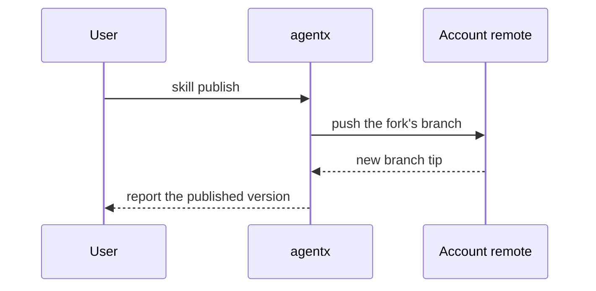

Write the PR body from the template in `.github/pull_request_template.md`.

## Sections

Skip all preambles and keep prose brief. Use the project's vocabulary from `GLOSSARY.md`.

### Summary

Pick the smallest view that makes the key point clear.

- Show logic or an algorithm as pseudocode:

```text
on(skill install)
  if the skill is already in the library at that version
    report it as installed
    return
  write the journal
  place the skill in each agent configuration
```

- Show runtime control flow as a call tree:

```text
cli.Run
  skill install
    resolveSource
    writeJournal
    placeSkill
  printReport
```

- Show file responsibility or a broad refactor as a shallow file tree:

```text
apps/cli/internal/
├── cli/        # parses commands and prints reports
├── home/       # owns ~/.agentx: journals, locks, machine settings
└── gitx/       # runs git
```

- Show component interaction, control flow, or data flow with Mermaid:



- Use `diff` when the point is what changes and the surrounding shape already exists. Match the diff shape to the topic.

For a file-layout change:

```diff
 apps/cli/internal/
 ├── cli/
+│   └── forkguard.go    # refuses a fork with unpublished edits
 ├── home/
-└── git.go
+└── gitx/
+    ├── refs.go
+    └── worktree.go
```

For a call-tree or call-stack change:

```diff
 cli.Run
   skill install
     resolveSource
+    skipDuplicateNames
     writeJournal
     placeSkill
   printReport
+    printSkipped
```

For a state or control-flow change:

```diff
 on(skill install)
-  write the journal
+  if the source names the skill twice
+    skip it and warn
+  write the journal
   place the skill in each agent configuration
```

- Show the whole block when most of it is new, when omitted context would hide ownership or order, or when the reviewer needs a copyable target shape:

```go
func skippedHint(name string) string {
	return fmt.Sprintf("skipped %s: its source names it twice", name)
}
```

#### Guidance

Place each visual next to the short text it supports. Keep only the calls, files, states, and boundaries a reviewer needs to understand the change.

Use one view, or a few when they each add something. Most PRs need only one or two.

### Evidence

Show that the change works, before and after. Evidence is optional unless the change affects functionality or behavior.

- For a visual change, prefer screenshots or a recording when the environment can produce them.
- For an execution-based change, paste the console output from before and after the change.
