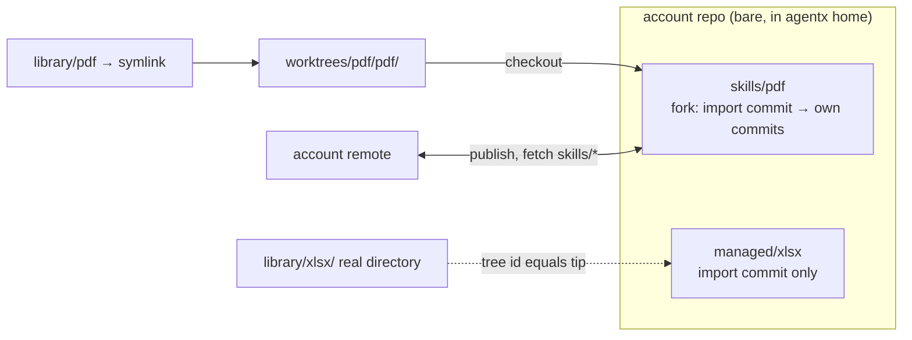

# Per-machine libraries, one account repo with a branch per fork checked out as worktrees, content moves only through install and update

Each machine owns its library at `~/.agents/skills`. Nothing in a library propagates to another machine on its own. Skill content reaches a machine only through an install, an update or a pull the user runs. Forks and greenfield skills live in one git repository per account, the account repo, as one branch per skill. Each machine holds its own bare clone in `~/.agentx` and checks out each fork it has placed as a linked worktree next to it; the library holds a symlink into that worktree. Which machine has which fork placed is which worktrees exist on it. Edits stay uncommitted until the user commits them, with agentx or with git in the worktree; agentx never commits on its own and never amends. Publishing is an explicit per-fork action that pushes that fork's branch to a per-account remote. Another machine installs a published fork once, from the account remote, with its id and history, and takes in later versions with a pull, a plain Git merge. Auto-push is a setting, off by default; it pushes the commits of a fork the account remote already holds once its branch has stood still for a quiet period, fast-forwards of the same fork only, and never commits. Managed skills that are not forks have no worktree and no history of their own: each has an import branch `managed/<name>` in the same repository pointing at the deterministic import commit of its base version, the library holds a real directory, and drift is a comparison of that directory's tree id with the commit's tree. Forking a managed skill, modified or not, writes a creation commit with a new fork id on top of its import commit, starts the fork's branch there and deletes the import branch, moves the library directory into the fork's worktree, and leaves a library symlink to it where the directory was.

## Why

Content moves only when the user asks: an install or an update from a third-party upstream, and an install or a pull from the account remote for the user's own forks. A fork edited and published on machine A is a new version of that fork on the account remote, and machine B takes it in when the user pulls, or updates the fork, by a plain Git merge of the two histories: a fast-forward when B has nothing of its own. Nothing is applied on B on its own. Explicit publish costs the near-instant propagation but means every version B receives is one the user released. A third-party upstream change is merged into the fork on whichever machine the user accepts it, then published; once published, no other machine is offered that upstream version again.

A branch per fork rather than a subdirectory per fork on one shared branch: publish, pull and conflict resolution happen per fork, so a half-finished fork never blocks releasing a finished one and a conflict in one fork never touches another. A machine checks out only the forks it uses, so a remote with many forks costs disk only for the placed ones. Two independently created forks receive different fork ids even when their histories share an upstream import. A same-name publish with a different fork id is refused; combining them requires an explicit choice. Removing a fork deletes its branch, worktree and placements on one machine, and its branch on the remote only when asked; renaming is a fork under the new name followed by that removal. On a shared branch, per-fork publish would need unpushed history rewritten on every push and pull would be all-or-nothing.

Every upstream version imported into the repo is committed with a fixed author, the upstream commit's timestamp written as epoch seconds in UTC since the timezone string is part of the commit id, a subject derived from source coordinates and content hash, and no parent, so the commit id is a pure function of the version and identical on every machine. The tree is placed under the upstream's own directory name, never the fork's, so a renamed fork still shares those ids with everyone else. A fork branch of a third-party skill starts at that import and adds its own creation commit. Independent forks of one upstream version therefore share a real git ancestor, and two machines importing the same upstream version refer to the same object. This alone does not guarantee conflict-free later merges. Because those commits have no parent, git cannot see that one upstream version follows another. The earlier proposal to chain imports with replace refs by import order is withdrawn. Observation order and timestamps do not prove ancestry; chaining sibling upstream versions can silently discard a change. The replacement, accepted on 2026-09-19 and simplified on 2026-09-27: an upstream update always merges with the recorded upstream base as the explicit merge base, and pulls and publishes between machines are plain Git merges on ordinary account history, fast-forwards first, whose conflicts are resolved like any other. There is no classification of content, no version or name choice and no record of selection intent beside the history. Each merge commit records the fork's base after it, the newer of two upstream versions only when the source history proves it and the local side's otherwise, so a wrong guess costs at most a conflict on the next update. The [fork-merge contract](../spec/fork-merges.md) defines the rules and the acceptance scenarios. No inferred grafts are used.

A fork's identity is a UUID recorded in `Agentx-Fork-ID` on a creation commit after the shared import. Greenfield creation records it on its first commit. Creation commits are never amended; installing an existing account fork preserves its id, while a separately created fork gets another. A rename makes a new fork with a new id, whose history holds the old one's commits; there is no rename detection.

The coordinates and hash of an imported version are commit trailers, and every merge commit agentx writes carries a trailer naming the import commit that is the base after it, so a clone that has only the branch can read a fork's upstream and base from its history. Nothing but the skill directory is in a fork's tree.

A single repository rather than one per skill: a 200-skill library measured 3x the disk, 130x slower `git status` and 200x slower `git fetch` as 200 repositories versus one. Worktrees share one object store and one fetch brings every branch, so the branch-per-fork layout keeps those numbers; 100 worktrees measured a 30 ms per-worktree status and a 0.25 s fetch. Worktrees only for forks rather than the whole library: a managed skill needs a base version, not a working history, and giving every installed skill a worktree would turn a 10 MB library into a repository the user did not ask for. Its import branch costs one ref and the objects of one tree, gives every machine the same commit id for the same version, and is what a fresh install reads to learn which upstream a library directory came from; three hundred such branches read in under a tenth of a second. The bare clone and linked worktrees, with the skill in a subdirectory of each worktree, keep every `.git` entry out of any directory an agent reads and out of every content hash.

## Considered and rejected

Live fleet-wide content sync, where an edit on A appears on B with no install step: needs a content transport in the sync engine, a relay through the editing machine for skills with no upstream, and a merge story for every skill rather than only forks. A git repository per skill: the fetch and status numbers above. One branch with a subdirectory per fork: the per-fork publish and pull problems above, plus every fork checked out on every machine. Upstream commits chained to the previously imported version: the commit id would then depend on which versions a machine happened to import, breaking the shared ancestor. An arbitrary explicit base for an account-branch pull lost a deliberate revert in an earlier experiment. That result does not reject a recorded accepted base for an upstream update; the accepted contract treats those two operations separately. A JSON manifest at the branch root recording kind, upstream and base: every field is already on the import commit or derivable from the graph, the file conflicts textually whenever two machines merged different upstream versions before publishing, and it would have to be kept out of every commit, diff, revert and the conflict flow. A base version cache keyed by content hash outside git for managed skills: it duplicated objects the repository already stores, and it was the one record of a managed skill's upstream that did not survive a reinstall. Content-addressed file rows in the metadata sync engine with commit reconstruction on each machine: a second content pipeline duplicating what a git remote already does. CRDT per file: files are written whole by external editors, so merging happens at save time anyway.

## Consequences

An unmanaged skill or an unpublished fork cannot be installed on another machine; the user forks and publishes first. A private third-party source the target machine cannot authenticate to fails the install there; content is never relayed. Deleting a fork's branch from the account remote never deletes it on other machines; they keep the branch and worktree until the fork is removed there. When the remote already holds a branch of the same name with a different fork id, the push is refused and the user adopts the existing fork, renames, or merges into it; combining distinct forks requires explicit intent and a valid merge base. Shared source coordinates alone do not establish that base. Fork and greenfield names follow the Agent Skills name grammar, lowercase letters, digits and single hyphens, at most 64 characters, which is also a valid branch name and cannot collide by case on a case-insensitive filesystem. The library at `~/.agents/skills` is read directly by Codex and Gemini CLI as their user skills directory, so for those clients the library is the placement and no symlink is made into their own directories. Installing into this universal location makes the skill discoverable by every agent client that reads it, regardless of enabled configurations or `--to`; those choices control only explicit placements. The install preview states this limitation. Any git tool run inside a fork's directory sees the account repo branch; commits made that way are ordinary user commits and are never amended by agentx. A fork of a plugin-owned skill replaces the plugin copy only in Gemini CLI; in Claude Code and Codex the plugin copy stays loaded under a namespaced name, so the fork coexists with it until plugin management can disable the original. A machine with no account still has full history and revert for its forks, and signing in later attaches the remote and pushes branch by branch. Worktrees need bookkeeping: agentx prunes stale worktree records on start, reports a missing worktree of a placed fork as "worktree missing", never as drift, and repairs it from the branch at serve start and on `skill place`, runs git maintenance itself on a timer rather than letting automatic gc fire inside a command, and any view across forks reads every branch rather than one log. Local import branches are neither fetched nor pushed in the MVP; only the fork namespace travels. In V1, separate managed backup refs keyed by machine and logical asset retain each machine's accepted base. Those backup refs never advance a local import branch automatically. Any command over the library spawns a bounded number of git processes, never one per skill: a bulk install writes its import commits in one batch, an update check compares tree ids in one call. Git 2.40 or newer is required for `git merge-tree --write-tree --merge-base` used by modified managed updates, and doctor refuses to run below it.

## Amendment, 2026-10-02

The account remote is a source of the fork layout, see [ADR 0008](0008-sources-have-a-layout-and-an-access-only-the-account-remote-is-pushed-automatically.md): its settings entry marks it as the account remote, and its remote in the account repo is `src-<id>`, named after its source id like every source's, where it was `origin`. Everything above about what travels through it stands: only `skills/*` branches, fetched whole, published by an explicit command or by auto-push, which pushes to the account remote and nowhere else. "Content moves only when the user asks" keeps its list; writing to any other source is an explicit command of its own, never a side effect of an install, an update or a publish.

## Amendment, 2026-10-03

Auto-push is removed: it is no longer a setting, and serve pushes nothing. Every push to the account remote is an explicit publish, see [ADR 0008](0008-sources-have-a-layout-and-an-access-only-the-account-remote-is-pushed-automatically.md).

Sources have no layout any more: the account remote is the source whose settings entry carries the account flag, and the "source of the fork layout" above means that source.

`skill revert` is removed, for managed skills and forks alike, and `skill unfork` is no longer reserved. Where the text above names a revert, a machine with no account keeps its forks' full history, commits and diffs; to get a managed skill's original back the user removes it and adds it again.

`pull` is removed. The account remote's changes arrive through `skill update`, whose account step takes in what another machine published of the user's own skill before any update from upstream, and `skill check-updates` lists them before you update. Where the text above names a pull, it is that account step; a merge it leaves pending is completed by the next `skill update` of the skill.

A publish never merges. When the account remote holds commits of a skill that this machine lacks, `skill publish` fails for that skill if this machine has commits or edits of its own to publish, or reports it as having nothing to publish if it does not, and `skill update` takes the remote's commits in.

There is no commit step any more, and `skill commit` is removed. Where the text above says edits stay uncommitted until the user commits them, they stay on this machine until the user publishes: `skill publish` records a skill's edits as one commit on its branch, by the fork commit writer, then pushes the branch. agentx still never records an edit on its own and never amends, and a commit made with git in a fork's worktree is still an ordinary commit of the branch that the next publish pushes. A publish that is refused, because the account remote moved on, cannot be reached or holds another skill of the name, records nothing.
