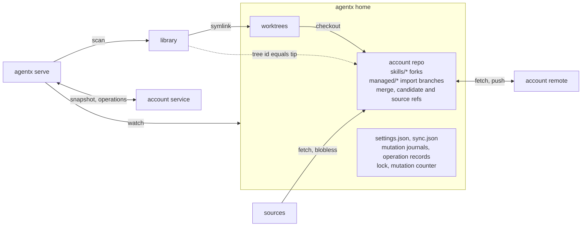

# No local database: git holds content and lineage, plain files hold machine state, the account service holds the fleet

agentx keeps no database on the machine. Every piece of local state has exactly one home, chosen by what must survive and who must see it.

| State | Home | Survives a reinstall | Visible to other machines |
|---|---|---|---|
| Fork and greenfield content and history | `skills/<name>` branches in the account repo, one worktree per placed fork | yes | after publish |
| Managed skill base versions and upstream coordinates | `managed/<name>` import branches in the account repo, no worktree | yes | V1: separate backup refs per machine and logical asset |
| Pending merges and update candidates | refs in the account repo | yes | no |
| Per-machine settings | `settings.json` in agentx home | yes | no; the fleet sees their effect in the snapshot |
| Local mutation journals | one file per mutation, with retained old content | until completion or recovery | no |
| Fleet upload protocol metadata | `sync.json`, with registered generation and reserved sequence | yes; validate on reconnect | ordering only |
| In-flight operation records | one file per operation in agentx home | until acknowledged | through the account service |
| The snapshot of this machine | memory of the serve child, recomputed by a scan | recomputed | through the account service when signed in |
| Fleet state: machines, snapshots, operations | the account service, one writer per record | not local | yes |
| The last fetched state of each source | refs of agentx's own in the account repo, blobless | re-fetched | no |
| MCP handshake signatures | one file in agentx home | rebuilt by the next handshake | no |

Mutating commands take one advisory lock in agentx home and finish by bumping a mutation counter file. The serve child watches that file, the account repo, the worktrees and the library, and re-emits the whole snapshot. Scans hold a shared lock across local reads; mutations and recovery hold the exclusive lock. Unfinished journals must be resolved before fresh inventory is emitted. Desktop ordering follows the [snapshot-ordering contract](../spec/snapshot-ordering.md). V1 fleet uploads use a separate durable sequence and a registered generation; restarting serve does not reset that sequence. Settings, fleet protocol metadata, mutation journals and operation records are written by temp file, fsync and rename, with the containing directory synced where required. Commands that change refs and live paths also follow the [mutation-safety contract](../spec/mutation-safety.md). A lock alone cannot recover a partially applied mutation. Journal recovery precedes reconciliation; unexpected edits stop recovery for resolution and are never overwritten. Sources are fetched into the account repo under refs of agentx's own, blobless and one ref per source, so an import commit is one object over a tree the fetch already stored and a check for updates is one round trip per source.

Two git environments. Commands that write objects or merge run with the user's global and system git configuration excluded and an explicit author, so an imported upstream version has the same commit id on every machine whatever the user's signing, hook or line-ending settings. Commands that touch the network run in the user's environment, so their credential helpers, SSH configuration and URL rewrites apply. agentx never stores git credentials. Source URLs are stored without any embedded user or token.

## Why

A local database alone supplies neither remote backup nor cross-machine visibility. Reinstall survival depends on retaining or backing up durable state, regardless of its storage format. The state the user cannot afford to lose, which upstream a skill came from and which version was its base, is therefore committed into the account repo as branches. A fresh install that retains the repo first recovers unfinished local mutations, then matches branches against the library and restores managed lineage, forks and their worktrees. V1 remote recovery uses separate backup refs for each machine and logical asset, preserving that machine's exact accepted base rather than an account-wide latest version. Everything the machine alone needs is either a handful of scalars, which fit in one file, or derived from the filesystem and git, which a scan recomputes in a quarter of a second for three hundred skills.

The product's queries were measured both ways. Plain code over the in-memory snapshot answered every screen the app has in fewer lines than a database with its schema and loaders, and ten to a hundred times faster. A persisted cache would have saved about a third of a second per command at three hundred skills, at the price of per-file validation, schema migrations and a second place a fact can be wrong.

Git config and git refs were tried as the settings store and the operation queue and rejected by measurement: no batch write, lost writes under contention, a stale lock file that blocks later worktree operations, and one hundred milliseconds and seven processes per operation. A JSON file under the existing lock does the same work in a millisecond with no failure mode git does not already have.

The fleet needs per-machine records with one writer each and a way to wake the target machine. That is a small service with a store behind it, not a synchronised database on every machine. Skill content never travels through it; git carries content.

## Considered and rejected

A local SQL database as the source of truth: needs its own retention and backup policy, remains invisible to machine B without a transport, and adds a second truth beside git for lineage. A local SQL database as a rebuildable cache: the staleness contract needs per-file validation, and the query layer got longer, not shorter. An in-process SQL engine over the snapshot: slower to populate than the structs it would copy, for queries that are map lookups. A synchronised database per machine with last-writer-wins: lost one side of concurrent offline edits silently in the scenarios tested, with the winner decided by clock skew, and loaded a second engine into the binary. Git config for settings and refs for operations: the measurements above. Skill metadata in SKILL.md frontmatter: conflicts with every upstream edit of the same lines, leaks into every library that installs a published fork, and means editing third-party files to store our state.

## Consequences

Hand edits are expected and survive. Retain unfinished mutation journals, their recovery content and unacknowledged operation records when reinstalling. Keeping only the account repo and worktrees preserves committed lineage and fork history, not settings or unfinished operations. A full wipe recovers only remotely backed-up state. `agentx export` writes the settings file and a lineage listing for people who want a readable copy; nothing reads it back except `agentx import`. Reinstalling on the same machine reclaims its fleet record because the machine id is derived from the platform, not generated. Two agentx processes serialise on the lock; a command that finds the lock held exits with its own code instead of waiting silently. Startup rejects Git below 2.40; doctor reports the same requirement and probes `merge-tree --write-tree --merge-base`. The desktop app imports the user's login shell environment before spawning the CLI so that network git commands behave as they do in a terminal. Later features that need account-wide metadata, such as sets and tags, get a branch of small files in the account repo keyed by skill identity, never a file inside a skill directory.
